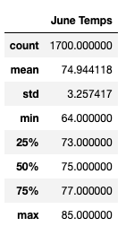
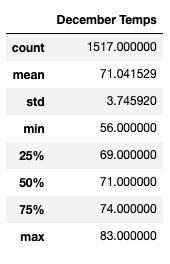

# surfs_up

## Overview of the anlaysis
This section explains the purpose of the analysis.

We want more information about temperature trends before opening the surf shop. Specifically, we want temperature data for the months of June and December in Oahu, in order to determine if the surf and ice cream shop business is sustainable year-round.

Using Python, Pandas functions and methods, and SQLAlchemy, I filter the date column of the Measurements table in the hawaii.sqlite database to retrieve all the temperatures for the month of June and December. I then convert those temperatures to a list, create a DataFrame from the list, and generate the summary statistics.

## Results
This section provides a bulleted list with three major points from the two analysis deliverables. 

The table below describes the summary statistics for the month of June:

The table below describes the summary statistics for the month of December:

Here is a list of three major points from the analysis:
- Avg temperature in June is 74.9 degrees Fahrenheit and standard deviation is within 3 degrees Fahrenheit
- Avg temperature in December is 71.0 degrees Fahrenheit and standard deviation is within 3.7 degrees Fahrenheit
-  Minimum temperature in June is 64 degrees Fahrenheit and minimum temperature in December is 56 degrees Fahrenheit

## Summary
This section provides a high-level summary of the results and two additional queries that you would perform to gather more weather data for June and December.

Here is a high-level summary of the results:
- June and December temperatures are relatively similar with an average of 74.9 degrees Fahrenheit in June and 71.0 degrees Fahrenheit in December
- There are some colder days in December with temperatures as cold as 56 degree Fahrenheit but those are rare and most of the time temperatures are in the 70s even in December.

Here are two additional queries that might be useful to gain further insights into the data:
- Summary statistics of temperature by weather station to determine if the temperature fluctuates by location. This could be useful to determine if certain locations are colder than others.
- A detailed breakdown of temperatures within the month of December to see if there are certain weeks that are colder than other weeks. 